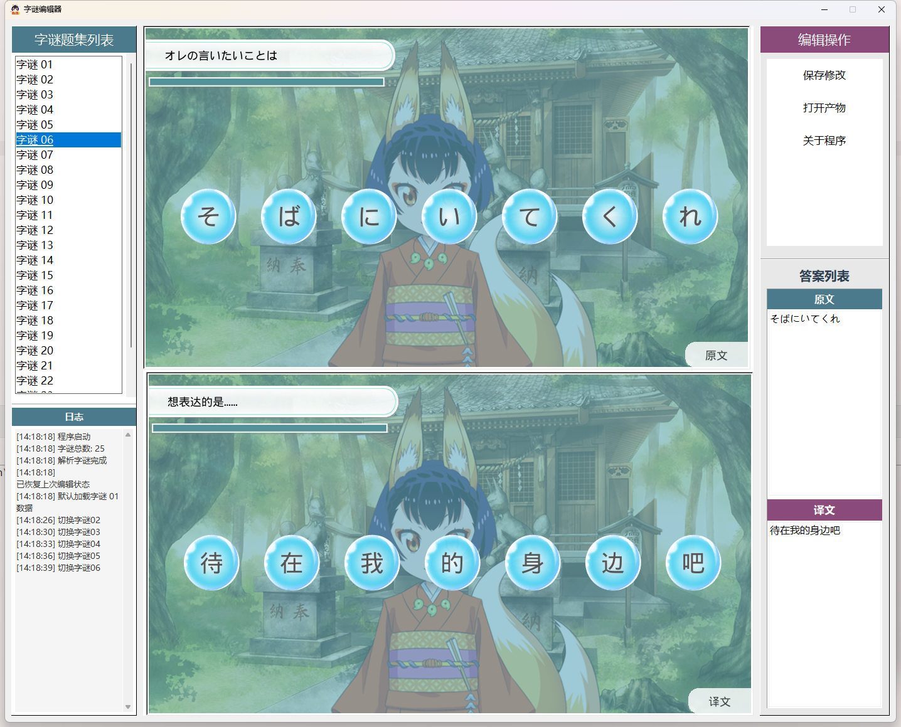

## Vita Nisekoi: Yomeiri!? Process Tool

* A script tool for processing the game Vita Nisekoi, capable of unpacking key assets from the game.

-------


## Showcase


-----

## Usage Guide

### Prepare data

```shell
# put all.apk & fs.apk to CI/Original folder.
# extract all resources with command
python3 auto_ci.py extract
```

### Generate patch files

```shell
python3 auto_ci.py repack
```

The final patch files in `CI/Product/PCSG00397` folder. Copy `PCSG00397` folder to ux0:rePatch.

----

## Format desc

| Format | Desc                                                                      |
|--------|---------------------------------------------------------------------------|
| *.ark  | UI file format([Format desc](format_desc/ark_format_desc.md)).            |
| *.gop  | Game actions file format ([Format desc](format_desc/gop_format_desc.md)). |

----

## Anagram Editor



[Anagram Editor](anagram_editor) is a streamlined editor for the in-game anagram minigame. It allows you to quickly edit
puzzle titles and
answers, dynamically add or remove selectable bubbles, and adjust their positions. Additional features can be explored
in the tool itself. The final exported output is `gop_talkanagram.gop`.

----

## Staffers

Programming: [Lisen](https://github.com/SpriteLisen)

Graphics: [笨蛋豆芽菜](https://space.bilibili.com/3546727550290635)

Editing & Proofreading: [小杨树的奇迹](https://space.bilibili.com/1640452570)
、[初銘](https://b23.tv/3Swg3IM) 、[今晚月色真美](https://b23.tv/lKT20qv)、天悬星河、[炒米粉](https://github.com/FriedRiceNoodles)

Production Support: X年X班

Video Production: 小幻

Quality Assurance: [诀别](https://v.douyin.com/ITgj_L3BUzo)、[凛lin](https://b23.tv/F9pJS9s)

----

## Thanks

[ymtools](https://github.com/akio7624/ymtools)

[ABF-File](https://github.com/akio7624/ABF-File)

[YomeiriModding](https://github.com/LevelHeadDeveloper/YomeiriModding)

## License

Please strictly comply with this project's [license](LICENSE).